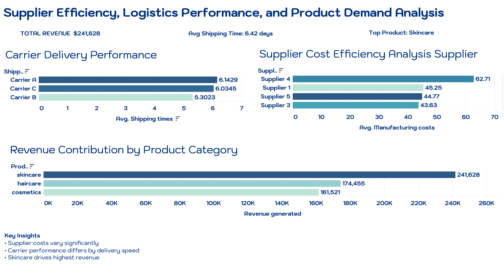

# Supply Chain Product Operations Project

## 📌 Overview
This project analyzes supply chain operations data to understand supplier performance, shipping efficiency, product sales, and inventory health. The goal is to simulate real-world Product Operations analysis similar to SaaS companies in the supply chain space.

---

## 🧰 Tools Used
- Python (Pandas)
- Jupyter Notebook
- VS Code
- GitHub

---

## 📊 Dataset
The dataset contains supply chain information including:
- Product types
- Suppliers
- Shipping carriers
- Manufacturing and shipping costs
- Sales and revenue metrics
- Inventory levels

---

## 🎯 Project Goals
- Analyze supplier performance
- Identify shipping inefficiencies
- Understand product revenue drivers
- Detect inventory risks
- Build KPI-style summaries for operations insights

---

## 📁 Project Structure
- data/ → raw dataset
- notebooks/ → analysis work
- scripts/ → reusable code
- dashboard/ → visualizations
- docs/ → insights and notes

---

## 🚧 Current Progress
- [x] Data loaded and explored
- [x] Initial structure analysis
- [ ] KPI analysis (in progress)
- [ ] Dashboard creation
- [ ] Final insights summary

---

## 📊 Key Insights

### Supplier Performance
- Supplier 4 has the highest manufacturing cost while also producing the highest volume, suggesting potential scalability inefficiencies.
- Supplier 2 appears to be the most cost-efficient at scale.

### Shipping Performance
- Carrier B has the fastest average shipping time.
- Carrier A shows the slowest performance and may require review.

### Product Performance
- Skincare is the top-performing category in both revenue and units sold, indicating strong demand concentration.

---

## Tableau Dashboard

